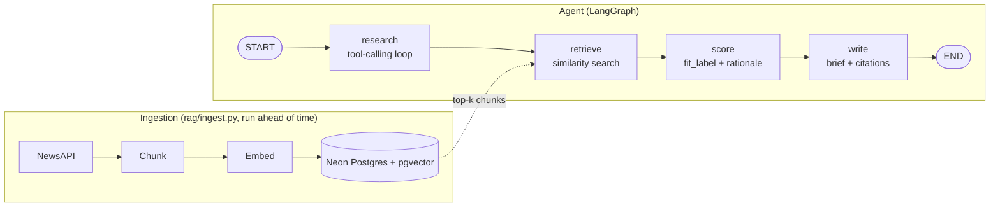

# Account Intelligence Agent

> **Status:** Active portfolio project. The agent runs end to end on real news data and produces a grounded qualification brief with source citations. Evals and deployment are next. See [Roadmap](#roadmap).

## Why

As an SDR, I spend 15–30 minutes researching a single company to qualify it as a prospect: news, filings, hiring signals. Those notes go into my CRM, and I spend another 15 minutes digging through them before I call. I've done this by hand for months. This agent does the research and qualification in seconds, and every claim in its brief links back to the source it came from.

You give it a company name. It pulls recent news, retrieves the most relevant passages, scores the account against an ICP (currently utilities and OT/industrial networking), and returns a structured qualification brief with citations.

## What it does today

- **LangGraph agent** with four nodes: `research → retrieve → score → write`
- **Tool-calling research loop** with Claude
- **NewsAPI fetcher** with a typed exception taxonomy and retry with exponential backoff, covered by unit tests
- **RAG pipeline:** chunking, OpenAI embeddings (`text-embedding-3-small`), storage and similarity search in **pgvector on Neon Postgres**
- **Batch ingestion script** with deduplication
- **Grounded scoring and brief generation:** the model is restricted to retrieved context
- **Citations:** each claim in the news summary is tagged `[Source N]`, and the brief includes a source list with real URLs resolved from the database

## Architecture



**Citation flow:** `retrieve` returns chunks with their article metadata. The `write` node labels each chunk `[Source N]` for the model, with no URLs shown to it. The model tags its claims with those labels. Code then extracts the tags with a regex and resolves each number back to its chunk's title, source, date, and URL.

## Design decisions

- **Research, score, and write are separate nodes.** Each stage can be inspected and tested on its own, and a failure points to a specific node.
- **Retrieve is its own node.** Both score and write need the retrieved chunks. If retrieval lived inside score, score would have two jobs, and write would depend on score having run it.
- **The fetcher is split into transport and policy.** `_call_api` makes one request and translates HTTP status codes into domain exceptions. `get_news` decides whether to retry and how long to wait. Each layer is tested by mocking the one below it, and retry rules can change without touching HTTP code.
- **Every chunk row stores its article's metadata** (title, source, URL, date). Any retrieved chunk can be cited on its own, without a join.
- **Grounding:** retrieved chunks go in user messages, and the "use only the provided context" rule goes in the system prompt. This keeps the model from blending training knowledge with retrieved evidence, so every claim is traceable.
- **The model cites by tag, and code resolves URLs.** If the model wrote URLs itself, it could get them wrong or invent them. Tags are short, they can be validated against the retrieved chunks, and the real URL always comes from the database. Invalid tags are recorded separately rather than shown to the reader.

## Known limitations

- **Thin news content:** NewsAPI's free tier truncates articles to about 200 characters, so retrieval works over teasers, not full text.
- **Syndicated duplicates:** deduplication is by URL, so the same story reposted on an aggregator is stored twice. In testing, this caused a real mis-citation. The model cited both copies for a claim that only the original states. Content-level dedup is planned.
- **Mocked fetchers:** company info and job postings are still hardcoded.
- **Fixed ICP:** scoring signals target utilities and OT/industrial networking.
- **Not yet evaluated or deployed:** see Roadmap.

## Running locally

```bash
# 1. Install dependencies
pip install -r requirements.txt   

# 2. Set environment variables in .env
ANTHROPIC_API_KEY=...
OPENAI_API_KEY=...                # embeddings
NEWSAPI_KEY=...
DATABASE_URL=...

# 3. Create the database tables
python -m database.setup

# 4. Load news into the vector store
python -m rag.ingest              

# 5. Run the agent
python main.py
```

## Project structure

```
account-intelligence-agent/
├── main.py                 # entry point: prompts for company, runs the graph
├── graph.py                # LangGraph wiring: research → retrieve → score → write
├── nodes.py                # node functions + citation helpers
├── state.py                # AgentState definition
├── tools.py                # tool definitions + dispatcher
├── fetchers/
│   └── news.py             # NewsAPI fetcher: exception taxonomy, retry/backoff
├── rag/
│   ├── chunker.py
│   ├── embedder.py
│   ├── store.py
│   ├── retrieve.py
│   └── ingest.py           # batch ingestion with dedup
├── database/
│   ├── connection.py
│   ├── schema.sql
│   └── setup.py
├── scripts/
│   └── news_api_t.py       # manual live check against NewsAPI
└── tests/
    └── test_news.py
```

## Roadmap

1. Full-article scraping and content-level dedup
2. Real company info fetcher
3. Real hiring or capital-investment signal (job postings or SEC EDGAR)
4. **Evals:** hand-labeled set of 10–15 companies, LangSmith tracing, citation-faithfulness metric
5. API layer for the agent
6. Docker and deployment with a public URL

**Stack:** Python · LangGraph · Claude API · OpenAI embeddings · pgvector · Neon Postgres · pytest